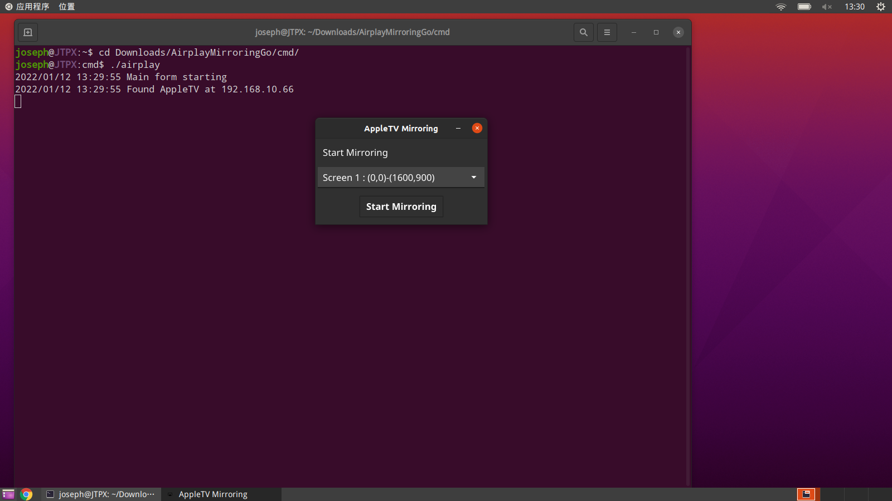
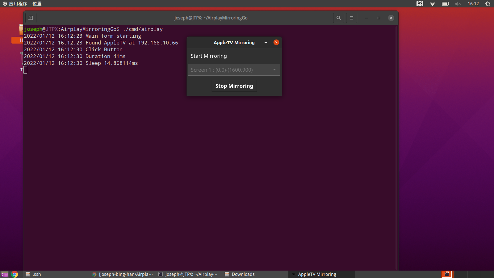

# AirplayMirroringGo

A cross platform airplay screen mirroring client by golang

## How to use
Step 1: get the application, there are two options.
   * Option 1: Download **[bin file](https://raw.githubusercontent.com/openairplay/AirplayMirroringGo/main/cmd/airplay)** for Linux amd64
   * Option 2: Download source code and build using this commands  
     ```shell
     git clone git@github.com:openairplay/AirplayMirroringGo.git
     cd AirplayMirroringGo
     make build
     ```
Step 2: run airplay in your CLI.
   

Step 3: waiting for searching Apple TV ip, the "Start Mirroring" button will be enabled after it found Apple TV

Step 4: click "Start Mirroring" to start mirroring and the button label will be change to "Start Mirroring", click "Start Mirroring" button will stop it.
   


### Welcome to pull request for this project !


## Thanks

[Unofficial AirPlay Protocol Specification](https://nto.github.io/AirPlay.html)  
[Fyne](https://fyne.io)  
[open-airplay](https://github.com/openairplay/open-airplay)  
